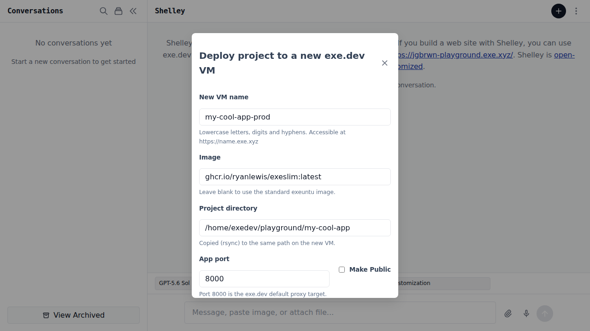
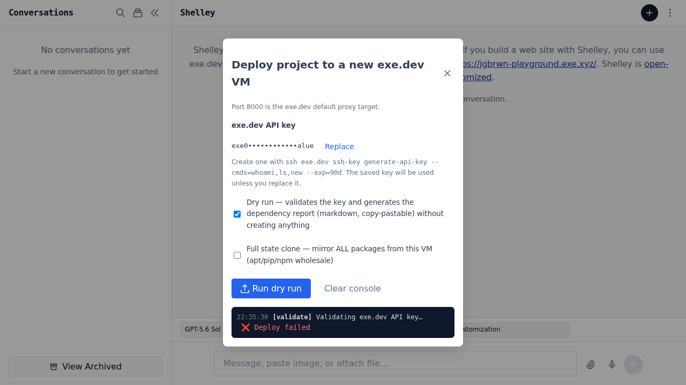
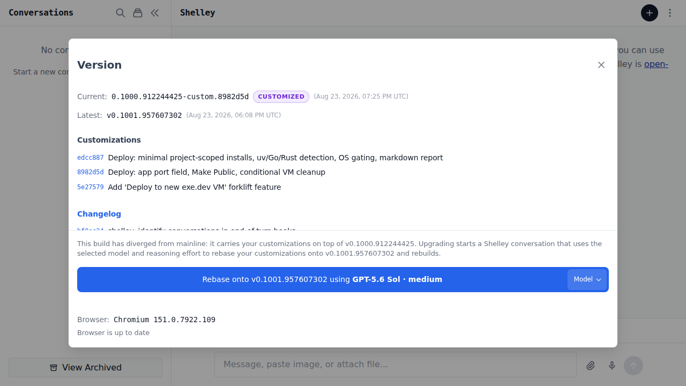

# Shelley Playground — exe.dev-Deployer

**Shelley Playground** is a fork of [Shelley](https://github.com/boldsoftware/shelley) (by [Bold Software](https://github.com/boldsoftware)) that you can install on your MacBook or Linux system — or use to **replace Shelley on an existing exe.dev VM**.

> Upstream: **https://github.com/boldsoftware/shelley** — the mobile-friendly, web-based, multi-conversation, multi-modal, multi-model, single-user coding agent built for [exe.dev](https://exe.dev).

Shelley Playground carries a small, well-scoped customization on top of upstream: **"Deploy to new exe.dev VM"** — a forklift that takes a project you've been hacking on in your playground and ships it to a fresh production exe.dev VM, reconciling system state for you.

---

## The playground idea

Create a `~/playground` directory and build your experiments, projects, and apps each in their own subdirectory underneath it:

```bash
mkdir -p ~/playground/my-cool-app
cd ~/playground/my-cool-app
# … hack …
```

Shelley Playground treats the **project directory** as the unit of deployment. The Deploy modal defaults its directory suggestion to your current conversation's cwd (usually something under `~/playground`), and the pipeline rsyncs that directory to **the same absolute path** on the new VM so hard-coded paths don't break.

This matches how most of us actually use exe.dev: one playground VM for development, many throwaway VMs for experiments, and then a clean production VM when the thing is ready.

---

## What makes Shelley Playground different from proper Shelley

Everything in upstream Shelley is here. On top of that:

### Deploy to new exe.dev VM

*Entry points:* chat overflow menu (⋮) → **Deploy to new exe.dev VM**, or `⌘K` / `Ctrl-K` → **Deploy**.

The modal collects:

| Field | What it does |
|---|---|
| **New VM name** | Lowercase letters/digits/hyphens; becomes `https://<name>.exe.xyz` |
| **Image** | Blank = default `exeuntu`; or prefilled `ghcr.io/ryanlewis/exeslim:latest`. Any image exe.dev supports works. |
| **Project directory** | Suggested from the current conversation's cwd; rsync'd to the same path on the new VM |
| **App port** | Auto-detected from processes running inside the project dir; drives `share port` + systemd `:PORT` rewriting |
| **Make Public** | Runs `share set-public` at the end; new VMs are private by default |
| **exe.dev API key** | Stored in the Shelley settings table (`deploy_api_key`), returned to the UI only masked; validated live via `POST https://exe.dev/exec` (`whoami`) |
| **Dry run** | Validates the key and prints the plan without creating anything |
| **Full state clone** | Opt-in; when on, diffs **all** apt/pip/npm/systemd/users/crontabs src→dst. Off by default (= minimal/project-scoped mode, see below) |

A live **SSE console** streams progress inside the modal. The run's events are also persisted to `deploy_runs` so the **Current run** can be reopened after a reload.

#### Reconciliation modes

* **Minimal (default)** — only the packages and runtimes your project actually needs, as inferred by `AnalyzeProject`:
  manifests (`requirements.txt`, `pyproject.toml` + `uv.lock`, `package.json` + lockfiles, `go.mod`, `Cargo.toml`, `Gemfile`, `composer.json`, `pom.xml`, `build.gradle`), shebang interpreters, and built ELF binaries (with a destination `ldd` check that reports missing shared libraries). Per-package retry + a `uv` astral.sh-installer fallback.
* **Full state clone** — wholesale src→dst diff of apt, global pip/npm, custom `systemd` units, extra users and crontabs. **Gated on host OS**: only offered on `linux/amd64` Debian/Ubuntu (`/etc/os-release`); on macOS/arm64 the checkbox is disabled with an explanation. Python venvs are always excluded from rsync and rebuilt on the destination.

#### Dependency report

Every deploy (including dry runs) generates a copy-pastable **markdown dependency report** that is streamed into the console, attached to the finished SSE event, and shown in the modal with a **Copy markdown** button. Also available without starting a deploy via

```
GET /api/deploy/analyze?dir=/home/exedev/playground/my-cool-app
```

#### Lifecycle

- Failed runs that actually created the VM offer **Delete VM `<name>`** (`POST /api/deploy/delete-vm` → `rm <vm>` with the saved API key). No delete button appears if the VM was never created.
- `POST /api/deploy/cancel` cancels an in-flight deploy; `GET /api/deploy/current` resumes the console.

Screenshots:

| Deploy modal — form | Deploy modal — live console | Version dialog — customized |
|---|---|---|
|  |  |  |

> Screenshots taken from the customized preview on `https://<host>.exe.xyz:8010` after `make build-custom`. If the image files are missing, rebuild and reopen the modal — the UI is the source of truth.

### Other small differences

- `make build-custom` stamps the binary as `Version: <upstream-tag>-custom.<sha>` with `Tag=<upstream-tag>` and `Customized=true`. The version dialog then shows **"customized"**, lists the custom commits, and replaces the "Upgrade & Restart" button with **"Rebase onto <latest_tag> using <model>"** — a conversation that uses the [customizing-shelley skill](https://github.com/boldsoftware/shelley/blob/main/AGENTS.md) to `git fetch && git rebase origin/main`, resolve conflicts, rebuild, and offer to install.
- No edits to existing DB tables: the customization adds `db/schema/038-deploy-tables.sql` (`deploy_settings`, `deploy_runs`) so rebases against future upstream migrations stay painless.
- `bin/shelley` version from this fork never self-upgrades via binary swap; it always goes through the rebase flow — so your customizations aren't silently discarded.

---

## Installation

### Pre-built binaries (Mac/Linux)

Every push to `main` and every nightly upstream rebase produces a release on **this** repo's [Releases](https://github.com/jgbrwn/shelley-playground/releases) page (see *Releases* below). Download is the same shape as upstream:

```bash
# latest from shelley-playground (not upstream)
curl -Lo shelley "https://github.com/jgbrwn/shelley-playground/releases/latest/download/shelley-playground_$(uname -s | tr '[:upper:]' '[:lower:]')_$(uname -m | sed 's/x86_64/amd64/;s/aarch64/arm64/')" && chmod +x shelley
./shelley serve
```

macOS Homebrew users can still use the upstream cask and then replace the binary (see next section).

### Replacing the Shelley that already runs on a fresh exe.dev VM

Most users meet Shelley for the first time on a fresh exe.dev VM where `shelley.service` is already running under `systemd` (via socket activation). To replace it with Shelley Playground **on that same VM**:

```bash
# 1. Clone the playground fork
git clone https://github.com/jgbrwn/shelley-playground ~/.config/shelley/shelley-customization
cd ~/.config/shelley/shelley-customization
git checkout main        # the playground's customized main

# 2. Build a stamped binary (requires Go, Node, pnpm, make)
make build-custom

# 3. Preview it off to the side first (safe)
~/.config/shelley/shelley-customization/bin/shelley -db /tmp/shelley-playground-preview.db serve -port 8010
# → open https://<your-vm>.exe.xyz:8010/ in your browser

# 4. Install over the running binary
DEST=$(curl -s "$SHELLEY_URL/version-check" | jq -r .executable_path)
# SHELLEY_URL is set in the VM shell (typically http://localhost:9999)
sudo cp ~/.config/shelley/shelley-customization/bin/shelley "$DEST.new"
sudo chown --reference="$DEST" "$DEST.new"
sudo chmod --reference="$DEST" "$DEST.new"
sudo mv "$DEST.new" "$DEST"

# 5. Restart — do this as the LAST action of the turn (so the installing
#    conversation gets continued after restart):
curl -fsS -X POST -H 'X-Shelley-Request: 1' "$SHELLEY_URL/exit?resume=true"
# If Shelley is not under systemd, just `systemctl restart shelley` or restart it manually.
```

After restart, the version dialog should show the `customized` badge and list the deploy commits.

> **Don't** use plain `make build` for an installed binary — an unstamped binary will offer the mainline "Upgrade & Restart" path that silently discards the customizations. Always use `make build-custom` for playground builds.

### Build from source (any machine)

```bash
git clone https://github.com/jgbrwn/shelley-playground.git
cd shelley-playground
make        # or `make build-custom` for a stamped, deploy-capable binary
```

See upstream [ARCHITECTURE.md](ARCHITECTURE.md) for the stack details (Go, SQLite, Vue 3 + PrimeVue).

---

## Keeping it fresh: rebasing against upstream Shelley

Shelley Playground intentionally stays close to upstream. The **version dialog** is the primary upgrade path:

1. Open the overflow menu (⋮) → **Check for updates** (or the version footer).
2. If the build is `customized` and upstream has a newer tag, the button reads **Rebase onto vX.Y.Z using <model>**.
3. Clicking it starts a Shelley conversation in `~/.config/shelley/shelley-customization` that runs:

```bash
git fetch origin main --tags
git rebase origin/main custom   # or main, depending on local checkout
# resolve conflicts, then:
make build-custom
go test ./server  # or narrower packages
# offer to preview on :8010 or install as above
```

The agent has the custom commits and their messages for context and will ask when intent is unclear. The server's `/version-check` endpoint lists the custom commits so you can see what will be rebased.

### Automatic daily releases

This fork's GitHub Actions keep releases fresh without manual intervention:

- **`.github/workflows/sync-upstream.yml`** ("Sync upstream & release") runs daily at 03:00 UTC (and on demand via `workflow_dispatch`):
  1. Fetches `boldsoftware/shelley` `main` as `upstream`.
  2. Checks whether `upstream/main` has moved beyond the playground's merge-base.
  3. Attempts `git rebase` of the playground commits onto `upstream/main`.
  4. On success, pushes the rebased `main`.
  5. Generates a new `v0.N.9OCTAL` tag (same scheme as upstream) for the current HEAD, and if the tag doesn't already exist, builds UI + templates and runs **GoReleaser** to publish cross-compiled binaries (linux/darwin, amd64/arm64) directly to this repo's Releases page.
  6. On rebase conflict, the workflow **fails loudly** (no force-push) — rebase by hand via the version dialog.

- **`.github/workflows/release.yml`** (mirrored from upstream) triggers on push to `main` via the `Test` workflow and is the secondary release path for manual pushes. `.goreleaser.yml` is retargeted to **`jgbrwn/shelley-playground`** (no Homebrew cask — upstream's `boldsoftware/tap` remains canonical for mainline Shelley).

In short: if upstream ships, this fork ships the next morning, fully rebased and released. And if you push to `main` manually, the test→release chain publishes too.

---

## Releases

Like upstream, versions follow `v0.N.9OCTAL` where `N` is the total commit count and `9OCTAL` is the commit SHA encoded as octal (prefixed with `9`). See [`.goreleaser.yml`](.goreleaser.yml) and `.github/workflows/release.yml`. Browse them at https://github.com/jgbrwn/shelley-playground/releases.

---

## Acknowledgements, license & NOTICE

Shelley itself is **Apache 2.0**, Copyright 2026 Bold Software, Inc. — see [`LICENSE`](LICENSE). This fork is distributed under the same license.

A [`NOTICE`](NOTICE) file carries the upstream attribution, the Shelley Playground delta, and third-party acknowledgements (exe.dev, exe-scroll, Chromium headless-shell, PrimeVue, etc.).

If you contribute to this fork, you agree your contributions are Apache 2.0 as well.

---

## Links

- Upstream Shelley: https://github.com/boldsoftware/shelley
- exe.dev: https://exe.dev
- This fork: https://github.com/jgbrwn/shelley-playground
- Shelley skill for customizing your own Shelley: search for `customizing-shelley` in the repo's `AGENTS.md`
